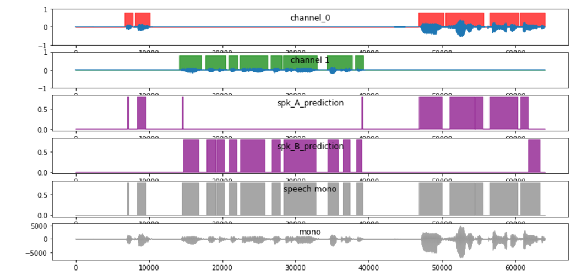

***
# Diarization project based on:
### https://arxiv.org/abs/1710.10468


***
## LSTM model trained on Vox2Celeb dataset:
### https://www.robots.ox.ac.uk/~vgg/data/voxceleb/vox2.html
 
***

## Model performance example: <br/>


***

## `src/data_processing/`
> multi threaded data processing before training stage

<br />

## `src/train/`
> LSTM training related source


<br/>

## `src/evaluate/`
> DER(Diarization Error Rate) metric evaluation on english CALLHOME: <br/> https://ca.talkbank.org/access/CallHome/

<br/>

## `src/vad/`
> VAD(Voice Activity Detector) training related source


***

# How to run:
## Prepare database
> cd lstm-diarization/container
> docker-compose up -d

## Create storage directory for test/train aac/wav files:
- trained models
- test / train datasets
- speech detection model

``` mkdir -p /home/your_username/storage/data ```

## Prepare storage/data directory tree as follows:
```
.
├── callhome
│   ├── eng						# speech label files
│   └── wav
├── gmm 							# gmm model path
│   └── final_gmm.pkl
├── model							# lstm model path
│   └── model.pt  	  # move best model here
├── train
│   ├── 1206_08:33    # autogenerated lstm model after train
│   ├── 1206_08:36
│   ├── 1206_08:38
│   ├── 1206_08:39
│   └── 1206_08:40
└── vox_1_test 				# example test / train structure
    └── wav
```


## Download any voxceleb dataset (unfortunately not available right now):
<https://robots.ox.ac.uk/~vgg/data/voxceleb>

- then unzip in storage/data directory
- voxceleb1 and voxceleb2 have the same tree structure

## Insert dataset into database
```
 conda activate diarization # as long as environment is ready 
 cd src/data_processing
 python postgre_data.py --threads=4 --data_source=vox_1_test/
```

## Train VAD model
- Open jupyter and run all cells of file
- lstm-diarization/src/vad/train_gmm.ipynb

## Train LSTM model
```
python train.py --epochs=50 --num_workers=8 --dataset=vox_1_test/ --warm_restart
```

## Guide todo:
- model DER evaluation on callhome dataset
